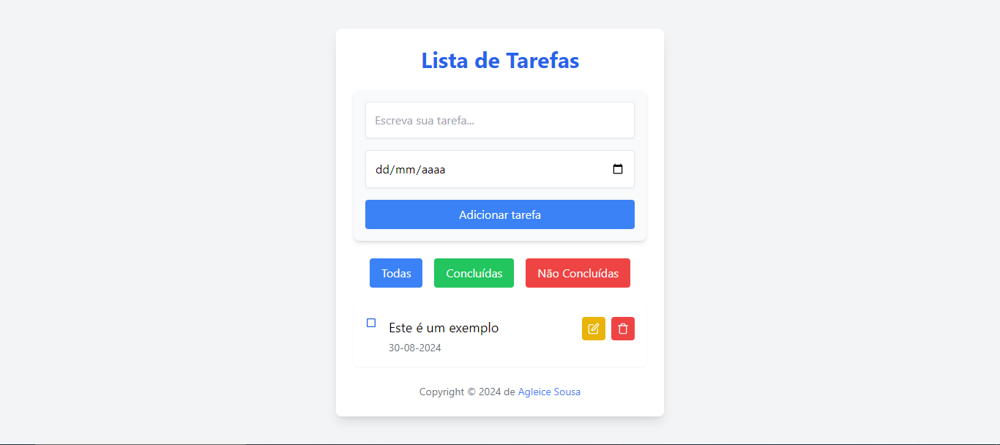
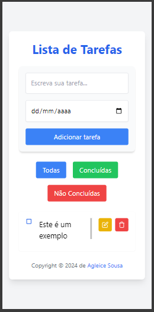

# Gerenciador de Tarefas

Este é um gerenciador de tarefas simples construído com React e Tailwind CSS. A aplicação permite adicionar, editar, remover e marcar tarefas como concluídas. As tarefas são armazenadas no `localStorage` para persistência entre recarregamentos da página.

## Funcionalidades

- Adicionar novas tarefas com uma data de vencimento.
- Editar tarefas existentes.
- Remover tarefas.
- Marcar tarefas como concluídas ou não concluídas.
- Filtrar tarefas por todas, concluídas ou não concluídas.
- Feedback visual para ações realizadas.

## Capturas de Tela

### Versão Desktop

Aqui está uma captura de tela da aplicação na versão desktop:



### Versão Mobile

Aqui está uma captura de tela da aplicação na versão mobile:



## Tecnologias Utilizadas

- **React**: Biblioteca para construção de interfaces de usuário.
- **Tailwind CSS**: Framework CSS para estilos rápidos e responsivos.
- **Vite**: Ferramenta de build para desenvolvimento rápido.
- **PropTypes**: Validação de tipos das props no React.

## Instalação

Para instalar e executar a aplicação localmente, siga os passos abaixo:

1. Clone o repositório:

   ```bash
   git clone https://github.com/agleicesousa/to-do-list-react.git
   ```

2. Navegue até o diretório do projeto:

   ```bash
   cd to-do-list-react
   ```

3. Instale as dependências:

   ```bash
   npm install
   ```

4. Inicie o servidor de desenvolvimento:

   ```bash
   npm run dev
   ```

5. Abra o navegador e acesse `http://localhost:3000` para ver a aplicação em funcionamento.

## Scripts

- `npm run dev`: Inicia o servidor de desenvolvimento.
- `npm run build`: Cria uma versão otimizada da aplicação para produção.
- `npm run lint`: Executa a análise de linting no código.
- `npm run preview`: Visualiza a aplicação de produção localmente.

## Estrutura do Projeto

- `public/index.html`: Arquivo HTML principal.
- `src/main.jsx`: Ponto de entrada da aplicação.
- `src/App.jsx`: Componente principal da aplicação.
- `src/components/TaskForm.jsx`: Componente para adicionar e editar tarefas.
- `src/components/TaskItem.jsx`: Componente para exibir uma tarefa individual.
- `src/components/Feedback.jsx`: Componente para exibir mensagens de feedback.
- `src/hooks/useTasks.js`: Hook personalizado para gerenciamento de tarefas.
- `src/hooks/useFeedback.js`: Hook personalizado para gerenciamento de feedback.
- `src/index.css`: Arquivo de estilos principal, configurado para Tailwind CSS.
- `index.css`: Configuração global de estilos e Tailwind CSS.
- `vite.config.js`: Configuração do Vite para o projeto.

## Licença

Este projeto é licenciado sob a [MIT License](LICENSE).

## Autor

Desenvolvido por **Agleice Sousa**
[GitHub](https://github.com/agleicesousa)
[LinkedIn](https://www.linkedin.com/in/agleice-sousa/)